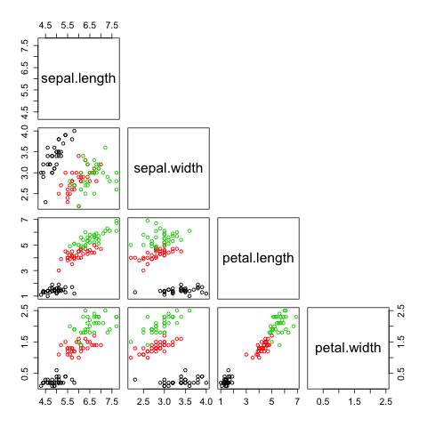
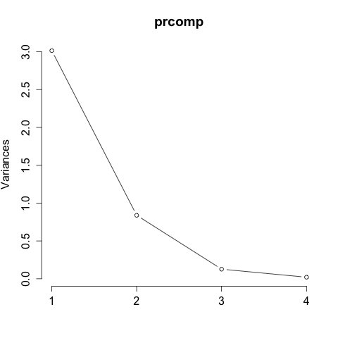

<h1>Predicting Iris Species with Multinomial Regression and Principal Component Analysis</h1>

<h2>About the Data</h2>
<blockquote>This famous (Fisher's or Anderson's) iris data set gives the measurements in centimeters of the variables sepal length and width and petal length and width, respectively, for 50 flowers from each of 3 species of iris. The species are Iris setosa, versicolor, and virginica.</blockquote>

You can read more about the data <a href='https://stat.ethz.ch/R-manual/R-patched/library/datasets/html/iris.html' target='_blank'>here</a>

<h2>Data Preparation</h2>

<h5>Initial Setup</h5>
If you have R installed, the ``iris`` dataset should have already been downloaded and can be loaded using the ``data`` function as shown below. 

If you haven't already installed the libraries that we will use, you can install them using the ``install.packages`` function. 

```r
## remove all global variables
rm(list = ls())

## setting working directory
setwd('/path/to/your/directory/')

## import libraries
library(nnet)  # for multinom()
library(caTools)  # for sample.split()
library(psych)  # for describeBy()

## import data
data(iris)

## lowercase column names
colnames(iris) <- tolower(colnames(iris))
```

<h5>Splitting the Data into Training and Test Datasets</h5>

Whenever I split the data into training and test sets, I use the ``sample.split`` function from the ``caTools`` package. One benefit of using the ``sample.split`` function is that it splits the data while maintaining similar distributions of outcomes in both the training and test datasets.

```r
set.seed(123)
split <- sample.split(iris$species, SplitRatio=2/3)
train <- iris[split==TRUE, ]
test <- iris[split==FALSE, ]
```

Notice how the ``iris`` dataset was separated to training and test sets without skewing the distribution of the outcome variable.

```r
table(train$species)
```

```
##    setosa versicolor  virginica 
##        33         33         33 
```

```r
table(test$species)
```

```
##    setosa versicolor  virginica 
##        17         17         17 
```

<h2>Exploratory Analysis</h2>
Here, I look at the means for sepal length, sepal width, petal length, and petal width for each species.
```r
## sepal and petal measurements means by species
setosa.mean <- apply(train[train$species=="setosa", -5], 2, mean)
versicolor.mean <- apply(train[train$species=="versicolor", -5], 2, mean)
virginica.mean <- apply(train[train$species=="virginica", -5], 2, mean)
means <- rbind(setosa.mean, versicolor.mean, virginica.mean)
means
```

```
##                sepal.length sepal.width petal.length petal.width
## setosa.mean         4.927273    3.375758     1.442424   0.2424242
## versicolor.mean     5.975758    2.815152     4.266667   1.3303030
## virginica.mean      6.624242    2.927273     5.557576   2.0515152
```

I can also use the ``describeBy`` function from the ``psych`` package to do this. The ``describeBy`` function also calculates many additional summary statistics for us, broken down by species, which is very convenient. When using this function, make sure that the outcome variable is a factor variable.

```r
## summary statistics by species using describeBy()
train$species <- as.factor(train$species)
describeBy(train, group=train$species)
```

```
## group: setosa
##              vars  n mean   sd median trimmed  mad min max range  skew kurtosis   se
## sepal.length    1 33 4.93 0.36    4.9    4.91 0.30 4.3 5.8   1.5  0.36    -0.26 0.06
## sepal.width     2 33 3.38 0.35    3.4    3.39 0.30 2.3 4.0   1.7 -0.55     0.65 0.06
## petal.length    3 33 1.44 0.20    1.4    1.44 0.15 1.0 1.9   0.9  0.28     0.15 0.03
## petal.width     4 33 0.24 0.11    0.2    0.23 0.00 0.1 0.6   0.5  1.26     1.91 0.02
## species*        5 33 1.00 0.00    1.0    1.00 0.00 1.0 1.0   0.0   NaN      NaN 0.00
## ------------------------------------------------------------------------------------ 
## group: versicolor
##              vars  n mean   sd median trimmed  mad min max range  skew kurtosis   se
## sepal.length    1 33 5.98 0.48    6.0    5.96 0.59 5.1 7.0   1.9  0.29    -0.81 0.08
## sepal.width     2 33 2.82 0.28    2.8    2.82 0.30 2.2 3.4   1.2 -0.11    -0.43 0.05
## petal.length    3 33 4.27 0.41    4.3    4.30 0.44 3.0 5.0   2.0 -0.81     0.93 0.07
## petal.width     4 33 1.33 0.17    1.3    1.33 0.15 1.0 1.7   0.7 -0.02    -0.59 0.03
## species*        5 33 2.00 0.00    2.0    2.00 0.00 2.0 2.0   0.0   NaN      NaN 0.00
## ------------------------------------------------------------------------------------ 
## group: virginica
##              vars  n mean   sd median trimmed  mad min max range  skew kurtosis   se
## sepal.length    1 33 6.62 0.55    6.5    6.60 0.44 5.6 7.7   2.1  0.34    -0.59 0.10
## sepal.width     2 33 2.93 0.29    3.0    2.93 0.30 2.2 3.6   1.4 -0.09    -0.06 0.05
## petal.length    3 33 5.56 0.52    5.5    5.51 0.59 4.8 6.9   2.1  0.63    -0.19 0.09
## petal.width     4 33 2.05 0.27    2.1    2.06 0.30 1.4 2.5   1.1 -0.33    -0.46 0.05
## species*        5 33 3.00 0.00    3.0    3.00 0.00 3.0 3.0   0.0   NaN      NaN 0.00
```

Lastly, when I examine data, I like to look at a pair-wise plot to see the relationship between any given two independent variables. The three colors (green, red, and black) represent the different iris species. 
```r
## pairs for all metrics
pairs(train[, 1:4], col=train$species, upper.panel=NULL)
```


<h2>Model Building Part 1: Using the Original Features</h2>
<h5>Model Building</h5>
Here, we will build a multinomial regression model. If the outcome was a binary variable, then we can use the ``glm`` function. However, in our case, the ``iris`` dataset contains an outcome variable that results in three classes: setosa, versicolor, and virginica. 

There are different ways to build a multinomial regression. I've chosen the ``multinom`` function from the ``nnet`` package because I found it the easiest. 

```r
## build a multinomial regression model using the original features
model <- multinom(species ~ ., data=train)
summary(model)
```

```
## Call:
## multinom(formula = species ~ ., data = train)
## 
## Coefficients:
##            (Intercept) sepal.length sepal.width petal.length petal.width
## versicolor    2.785262     -1.84783   -12.29761     21.71541   -17.20664
## virginica   -18.730078    -21.39840   -42.15700     49.66432    38.71545
## 
## Std. Errors:
##            (Intercept) sepal.length sepal.width petal.length petal.width
## versicolor    3999.281     1692.268    2106.729     2155.711    5282.674
## virginica     4100.968     1758.851    2410.049     2853.967    5385.270
## 
## Residual Deviance: 0.005454292 
## AIC: 20.00545 
```

<h5>Make Predictions</h5>
```r
preds <- predict(model, newdata=test)  # model based on original features
```

<h5>Test Accuracy with Confusion Matrix</h5>
```r
conf_matrix <- table(preds, test$species)
conf_matrix
```

```
## preds        setosa versicolor virginica
##   setosa         17          0         0
##   versicolor      0         13         2
##   virginica       0          4        15
```

There were 6 misclassifications and the model achieved 88% accuracy.

<h2>Creating Principal Components</h2>

Instead of using the original features to build a model, we can generate principal components from the original features, with which we can build another model. There are many benefits to using principal component analysis (PCA) when modeling.

In PCA, each principal component explains a portion of variance in the data. What does that mean? In a situation where you have many independent variables, PCA helps you figure out the components that matter the most. This is especially helpful when there are hundreds (or even thousands) of features, and you aren't sure which of the features are important to build a good model. You can certainly choose to include all the variables to your model. However, this is a terribly bad practice as it often leads to overfitting and multi-collinearity. A good practice is to include only the significant variables that can generalize well over unseen data. 

<h5>Creating Principal Components Object</h5>
In this example, I will use the ``prcomp`` function to generate an object for principal components.
```r
#### create prcomp object
features_train <- as.matrix(train[ , -5])  # original features
prcomp <- prcomp(features_train, retx=TRUE, center=TRUE, scale=TRUE)  # prcomp object
```


<h5>Examine the Principal Component Object</h5>
```r
class(prcomp)
```
```
## [1] "prcomp"
```

```r
summary(prcomp)
```
```
## Importance of components:
##                           PC1    PC2     PC3     PC4
## Standard deviation     1.7363 0.9157 0.35582 0.14223
## Proportion of Variance 0.7537 0.2096 0.03165 0.00506
## Cumulative Proportion  0.7537 0.9633 0.99494 1.00000
```

```r
plot(prcomp, type='l')
```


You can see from the summary output and the plot that the first two principal components explain the majority of the variance in the data (more than 95%). The first principal component alone explains more than 75% of the variance.

<h5>Comparison between Original Features and Principal Components</h5>

The values of principal components can be found in the ``x`` attribute in the ``prcomp`` object.
```r
pc_train <- prcomp$x
```

You can use the ``head`` function to visually inspect the first few rows of the original features and principal components that we generated.

```r
head(features_train)  # original features
```
```
##    sepal.length sepal.width petal.length petal.width
## 1           5.1         3.5          1.4         0.2
## 3           4.7         3.2          1.3         0.2
## 6           5.4         3.9          1.7         0.4
## 7           4.6         3.4          1.4         0.3
## 9           4.4         2.9          1.4         0.2
## 10          4.9         3.1          1.5         0.1
```

```r
head(pc_train)  # principal components
```

```
##          PC1        PC2         PC3         PC4
## 1  -2.300518 -0.5591393  0.17997498 -0.01354624
## 3  -2.352618  0.3172238 -0.03138120 -0.04324666
## 6  -2.178991 -1.6727989  0.07816131  0.02756511
## 7  -2.463976 -0.1375880 -0.29849534  0.02416241
## 9  -2.277898  1.1482554 -0.17362400 -0.01021378
## 10 -2.158813  0.4866467  0.25098138  0.02921229
```

Note that the number of principal components will always be less than or equal to the number of original features.

<h5>Create a New Training Dataset with Principal Components</h5>

```r
train_pca <- as.data.frame(pc_train)
train_pca$species <- train[ , 5]
```

<h5>Original Train Dataset</h5>
```r
head(train)
```
```
##    sepal.length sepal.width petal.length petal.width species
## 1           5.1         3.5          1.4         0.2  setosa
## 3           4.7         3.2          1.3         0.2  setosa
## 6           5.4         3.9          1.7         0.4  setosa
## 7           4.6         3.4          1.4         0.3  setosa
## 9           4.4         2.9          1.4         0.2  setosa
## 10          4.9         3.1          1.5         0.1  setosa
```

<h5>New Train Dataset (with Principal Components)</h5>
```r
head(train_pca)
```
```
##          PC1        PC2         PC3         PC4 species
## 1  -2.300518 -0.5591393  0.17997498 -0.01354624  setosa
## 3  -2.352618  0.3172238 -0.03138120 -0.04324666  setosa
## 6  -2.178991 -1.6727989  0.07816131  0.02756511  setosa
## 7  -2.463976 -0.1375880 -0.29849534  0.02416241  setosa
## 9  -2.277898  1.1482554 -0.17362400 -0.01021378  setosa
## 10 -2.158813  0.4866467  0.25098138  0.02921229  setosa
```

<h5>Build a New Test Dataset with Principal Components</h5>
Just like we have generated the ``train_pca`` dataset from the ``train`` dataset, we need to generate ``test_pca`` dataset from the ``test`` dataset. This is done by utilizing the ``predict`` function. Note that <strong>we are NOT making any predictions on the test dataset</strong> here. We are simply creating principal component values using the original feature values from the test dataset.

```
test_pca <- predict(prcomp, newdata=test[ , -5])  # matrix
test_pca <- as.data.frame(test_pca)  # data frame
test_pca$species <- test$species
```

<h5>Original Test Dataset</h5>
```r
head(test)
```
```
##    sepal.length sepal.width petal.length petal.width species
## 2           4.9         3.0          1.4         0.2  setosa
## 4           4.6         3.1          1.5         0.2  setosa
## 5           5.0         3.6          1.4         0.2  setosa
## 8           5.0         3.4          1.5         0.2  setosa
## 11          5.4         3.7          1.5         0.2  setosa
## 16          5.7         4.4          1.5         0.4  setosa
```

<h5>New Test Dataset (with Principal Components)
```r
head(test_pca)
```

```
##          PC1        PC2         PC3         PC4 species
## 2  -2.042440  0.7091891  0.22422518 -0.11731322  setosa
## 4  -2.274034  0.5900452 -0.09487838  0.04320379  setosa
## 5  -2.439504 -0.7563788  0.04734691  0.04611888  setosa
## 8  -2.254141 -0.2838045  0.12612755  0.02764051  setosa
## 11 -2.234247 -1.1576541  0.34713347  0.01207723  setosa
## 16 -2.439075 -2.9764048  0.14162348  0.01301061  setosa
```

Now, we have generated ``train_pca`` and ``test_pca`` datasets that contain the principal components instead of the original features. We will use these datasets to build our model in the next section.

<h2>Model Building Part 2: Using the Principal Components</h2>

<h5>Build a Multinomial Regression Model</h5>
Since the first two principal components explain over 95% of the variance in the data, we will use PC1 and PC2 to construct our model and exclude PC3 and PC4.
```
model_pca <- multinom(species ~ PC1 + PC2, data=train_pca)
```

<h5>Make Predictions</h5>
Since our model uses the principal component values and not the original feature values, make sure to pass in the ``test_pca`` dataset (and not ``test`` dataset) when calling the ``predict`` function.

```r
preds_pca <- predict(model_pca, newdata=test_pca)  # model that uses principal components
```

<h5>Test Accuracy with Confusion Matrix</h5>
```r
conf_matrix_pca <- table(preds_pca, test$species)
conf_matrix_pca
```
```
## preds_pca    setosa versicolor virginica
##   setosa         17          0         0
##   versicolor      0         12         3
##   virginica       0          5        14
```

There were 8 misclassifications and the model achieved 84% accuracy in the test dataset.